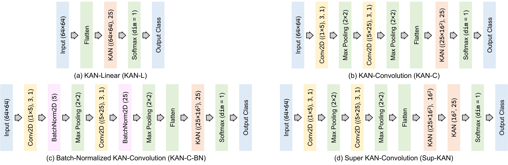

# `KOL-4-GEN`: Stacked Kolmogorov-Arnold and Generative Adversarial Networks for Malware Binary Classification through Visual Analysis

Malware classification using visual analysis, which involves converting malware binaries into images to uncover class-specific patterns, is a growing research area. This paper introduces \textsc{Kol-4-Gen}, a suite of four novel deep learning models based on the `Kolmogorov-Arnold Network` (KAN) with trainable activation functions. To address potential data imbalance, a `Generative Adversarial Network` (GAN) is also employed during training. Tested on the `Malimg` (grayscale, imbalanced, 25 classes), `Malevis` (RGB, balanced, 26 classes), and `Virus-MNIST` (grayscale, imbalanced, 10 classes) datasets, the models achieved validation accuracies of approximately **99.36%**, **95.44%**, and **92.12%**, respectively, surpassing state-of-the-art methods.

Following are the architectural view of the 4 deep learning models proposed under `KOL-4-GEN`

Following are the Confusion Matrices of the best performers (out of 4 models under `KOL-4-GEN`) for the `Malimg` (grayscale, imbalanced, 25 classes), `Malevis` (RGB, balanced, 26 classes), and `Virus-MNIST` (grayscale, imbalanced, 10 classes) datasets respectively. 

**FOR DATASETS (RAW + GAN BALANCED), PRETRAINED MODELS, AND OTHER SUPPLEMENTARIES VISIT https://drive.google.com/drive/folders/1VkXbmUSf1UYOKgZfFmKMxCOeYypEg5WJ**
